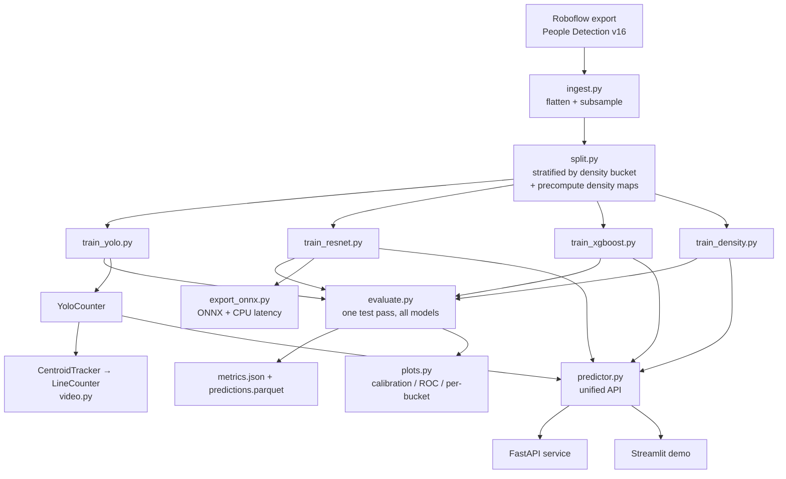

# Architecture

## Problem

Given a still image or a video stream from a fixed camera overlooking an indoor
space, estimate **how many people are present**. Two operating regimes:

| Regime | Signal | Consumer |
| --- | --- | --- |
| **Snapshot occupancy** | count in a single frame | HVAC setpoint, capacity alert, utilisation logging |
| **Flow occupancy** | net `entries − exits` over a doorway line | live "people in room" without a full-room camera |

## Pipeline

## The four counters

| Model | Family | Input → output | Why it's here |
| --- | --- | --- | --- |
| **YOLOv8n** | object detection | image → person boxes → `count = #boxes` | Localises each person; tiny (3.2 M params) so it runs on edge hardware; feeds the tracker. Fails silently under heavy occlusion. |
| **ResNet18 regressor** | direct CNN regression | image → scalar | Cheapest to run; robust to overlap because it never has to separate individuals. Black box — no "where". |
| **XGBoost on ResNet18 embeddings** | frozen backbone + GBM | image → 512-d embedding → scalar | Strong **small-data** baseline: no deep fine-tuning to overfit, heavy regularisation, fast to train. Best MAE in every experiment so far. |
| **CSRNet-lite** | density-map estimation | image → H/8 × W/8 density map → `count = Σ map` | The crowd-counting SOTA family. Dilated convolutions keep a large receptive field without losing resolution. Degrades gracefully as the room fills. |

## Tracking

`CentroidTracker` — greedy nearest-centroid association with a *disappeared*
grace window, so a person briefly lost to occlusion keeps their ID rather than
being recounted. `LineCounter` watches for tracks crossing an oriented segment
and maintains `occupancy = start + entries − exits`. Both are numpy/scipy-only
and API-compatible with a later swap to ByteTrack / OC-SORT.

## Evaluation philosophy

The test set is small (~120 images), so:

* every headline metric carries a **bootstrap 95% CI** (2000 resamples);
* errors are broken out **per density bucket** (`empty / low / medium / high`) so
  an average can't hide "great on empty rooms, useless when crowded";
* **mean bias** is reported to catch systematic over/under-counting;
* the split is **stratified by density bucket** so all three splits share a
  distribution.

## Serving & edge

* `FastAPI` — `POST /predict?model=…` multipart image → JSON count.
* `Streamlit` — upload UI + the model-comparison dashboard.
* `export_onnx.py` — ONNX export plus a torch-vs-onnxruntime CPU latency table
  (p50/p95, throughput) to substantiate the "runs on a Raspberry Pi" claim.
* `Dockerfile` / `docker-compose.yml` — CPU inference image + optional MLflow
  tracking server.
